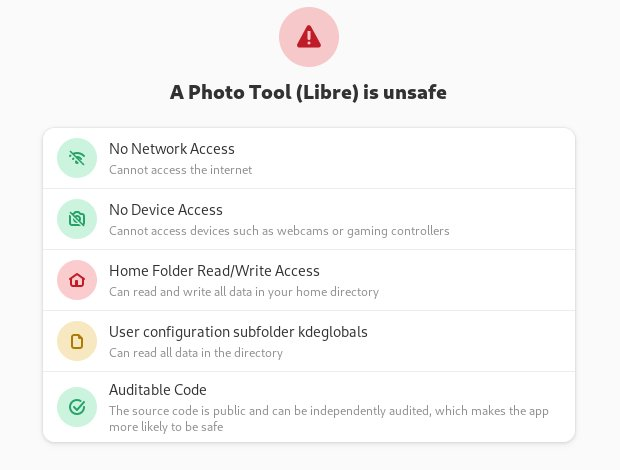
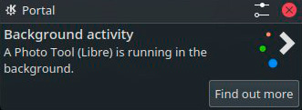
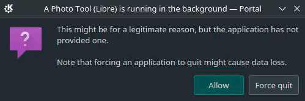

### How to Install (Flatpak for 64 bit Intel / AMD or 64 bit ARM)

A Flatpak version of A Photo Tool (Libre) can be installed from Flathub. 

&nbsp;&nbsp; 
						
Your system may include Flathub preinstalled and you can find A Photo Tool (Libre) directly in your app manager or installer. The application can be found by its friendly name A Photo Tool (Libre) or by its id me.ahola.aphototoollibre.

***

#### Is A Photo Tool (Libre) safe?

Yes, A Photo Tool (Libre) is safe if downloaded from reputable source. Some package managers and installers may inform users for example that A Photo Tool (Libre) has access to home folder. This is to allow you to load and save photos.

&nbsp;&nbsp;  

A Photo Tool (Libre) does not access any of your files on its own. 

#### Why A Photo Tool (Libre) runs in the background?

Your system may inform you that A Photo Tool (Libre) is running in background. Please, allow it to run.

&nbsp;&nbsp;  &nbsp;&nbsp;  
	
There is a process 	that creates full resolution version of a photo you are currently editing. When making change to a Photo
you see immediately the result on a low resolution preview. Because full resolution image takes longer time to process, 
the background process makes full resolution version to be shown to you as soon as possible. 
	
